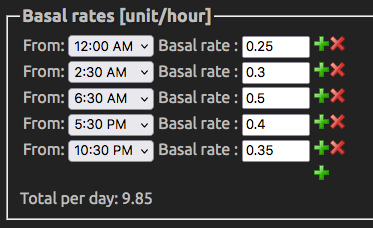

# Initial Settings

The following *Settings* are listed in order of appearance in the *iAPS* app. Click the _Cog Wheel_ (bottom right of the iAPS main screen) to view/change your Settings.

## SERVICES

### Nightscout
- *URL* - **Your Nightscout URL** ( NO / at the end)
- *Password* -  **Your API Secret** as the *password*
- **Connect** - Tap --> *Connected!*
- *Allow Uploads* - **Enable**

### CGM
- *Type* - **Dexcom G6**
- *Transmitter ID* - **Enter current**

### Notifications
- Your choice, e.g. **All** turned **Off**, set **High ---> 10**


## CONFIGURATION

### Preferences
Following are the _Default Settings_ that will get you started.

Tapping on many of the listings in the app will bring up an explanation of what each setting means and its relevance.

#### FREEAPS X
- *Glucose Units* - **mmol/L**
- *Remote Control* - **FALSE**
- *Recommended Insulin Fraction* - **2**
- *Skip Bolus screen after carbs* - **FALSE**
- *Display HR on Watch* - **FALSE**
- *Display Statistics* - **TRUE**

#### STATISTICS
- *Low Glucose Limit (mmol/L)* - **4**
- *High Glucose Limit (mmol/L)* - **10**
- *Update every number of minutes:* - **30**
- *Display SD instead of CV* - **FALSE**
- *Display Loop Cycle statistics* - **FALSE**
- *Override HbA1c unit* - **TRUE**

#### OPENAPS MAIN SETTINGS
- *Insulin curve* - **rapid-acting**
- *Max IOB* - **10**
- *Max COB* - **120**
- *Max Daily Safety Multiplier* - **3**
- *Current Basal Safety Multiplier* - **4**
- *Autosens Max* - **1.2**
- *Autosens Min* - **0.7**

#### DYNAMIC SETTINGS
- *Enable Dynamic ISF* - **TRUE**
- *Enable Dynamic CR* - **TRUE**
- *Adjustment Factor* - **1**
- *Use Sigmoid Function* - **FALSE**
- *Weighted Average of TDD. Weight of past 24 hours:* - **0.65**
- *Adjust basal* - **TRUE**
- *Threshold Setting (mg/dl)* - **65**

#### OPENAPS SMB SETTINGS
- *Enable SMB Always* - **TRUE**
- *Max Delta-BG Threshold SMB* - **0.3**
- *Enable SMB with COB* - **FALSE**
- *Enable SMB With Temptarget* - **FALSE**
- *Enable SMB After Carbs* - **FALSE**
- *Allow SMB With High Temptarget* - **FALSE**
- *Enable SMB With High BG* - **FALSE**
- *... When Blood Glucose Is Over (mg/dl):* - **110**
- *Enable UAM* - **TRUE**
- *Max SMB Basal Minutes* - **30**
- *Max UAM SMB Basal Minutes* - **30**
- *SMB Delivery Ratio* - **0.5**
- *SMB Interval* - **3**
- *Bolus Increment* - **0.05**

#### OPENAPS TARGETS SETTINGS
- *High Temptarget Raises Sensitivity* - **FALSE**
- *Low Temptarget Lowers Sensitivity* - **FALSE**
- *Sensitivity Raises Target* - **FALSE**
- *Resistance Lowers Target* - **FALSE**
- *Advanced Target Adjustments* - **FALSE**
- *Exercise Mode* - **FALSE**
- *Half Basal Exercise Target* - **160**
- *Wide BG Target Range* - **FALSE**
- 
#### OPENAPS OTHER SETTINGS
- *Rewind Resets Autosens* - **FALSE**
- *Use Custom Peak Time* - **FALSE**
- *Insulin Peak Time* - **75**
- *Skip Neutral Temps* - **FALSE**
- *Unsuspend If No Temp* - **FALSE**
- *Suspend Zeros IOB* - **FALSE**
- *Bolus Snooze DIA Divisor* - **2**
- *Min 5m Carbimpact* - **8**
- *Autotune ISF Adjustment Fraction* - **1**
- *Remaining Carbs Fraction* - **1**
- *Remaining Carbs Cap* - **90**
- *Noisy CGM Target Multiplier* - **1.3**

### Basal Profile

- Copy from old **Loop** or **Nightscout**, or as advised.



### Insulin Sensitivities
- **Use _Autotune_ value**

To calculate your theoretical ISF:
```
ISF = c / TDD / BG
    c = 277700 if using mg/dL
    c = 857 if using mmol/L
    TDD = average total daily insulin (bolus plus basal)
    BG = target blood glucose
```

### Carb Ratios
- **Use _Autotune calculated value_**

## Target Ranges
- **Set to whatever range with which you are comfortable**  
**Lower range** is the one that matters e.g. 5.5 - 5.5, 24/7

## Autotune 
- **Enable**

## Individual Settings

The following settings can be changed to e unique to each individual:

- Max IOB
- Autosens Max
- Autosens Min
- Max SMB Basal Minutes
- Max UAMSMB Basal Minutes
- Adjustment Factor

**Initial Settings** described above are common to everyone.


